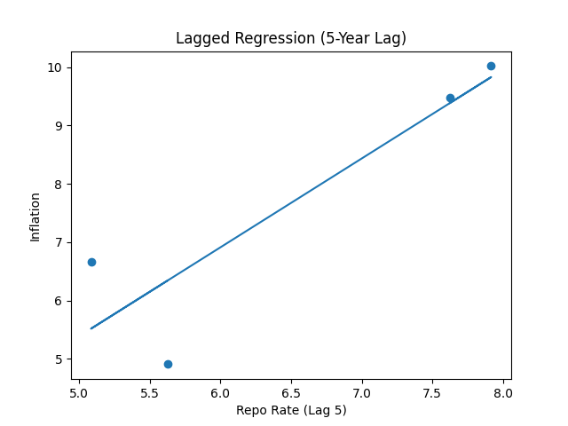
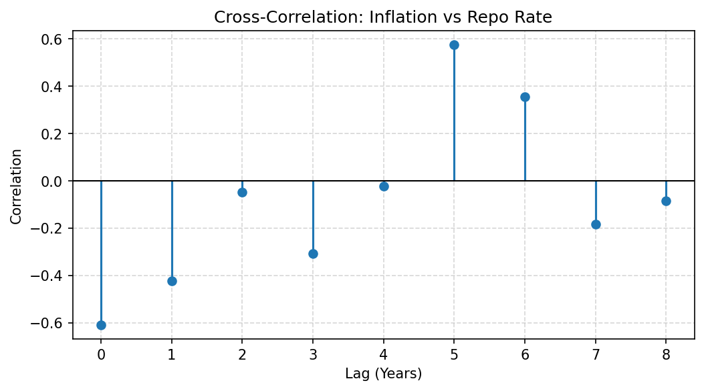

# 📊 RBI Inflation & Monetary Policy Analysis

> A data-driven analysis of the relationship between India's CPI Inflation and the RBI Repo Rate — built as part of an **RBI Research Internship application**.

---

## 🧭 Objective

To empirically examine how the Reserve Bank of India's monetary policy instrument — the **Repo Rate** — relates to and transmits into **Consumer Price Inflation (CPI)** over time, using publicly available macroeconomic data.

---

## 📁 Project Structure

```
RBI_Inflation_MonetaryPolicy_Analysis/
│
├── RBI_Inflation_MonetaryPolicy_Analysis.ipynb   # Main research notebook
├── data/
│   ├── cpi_india_worldbank.csv                   # CPI data (World Bank)
│   └── rbi_repo_rates.xlsx                       # Repo Rate data (RBI DBIE)
├── ccf_plot.png                                  # CCF plot with confidence intervals
├── regression_plot.png                           # Regression scatter plot
└── README.md
```

---

## 📦 Data Sources

| Dataset | Source | Coverage |
|---|---|---|
| CPI Inflation (India) | [World Bank Open Data](https://data.worldbank.org/) | Filtered for India |
| Repo Rate | [RBI DBIE (Database on Indian Economy)](https://dbie.rbi.org.in/) | Annual averages |
| **Merged Dataset** | Both sources combined | **2007–2015 (9 observations)** |

---

## 🔬 Methodology — Notebook Walkthrough

| Cell | Description |
|---|---|
| 1 | Title, objective, motivation, tools, and data sources |
| 2 | Library imports: `numpy`, `pandas`, `matplotlib`, `seaborn`, `statsmodels`, `adfuller` |
| 3 | Load & process CPI data (World Bank CSV → melt to Year-Inflation format) |
| 4 | Load & process Repo Rate data (RBI XLSX → annual averages) |
| 5–6 | Merge both datasets on Year, sort, reset index |
| 7 | Data validation — confirms 2007–2015 coverage, 9 observations |
| 8–9 | **Line chart**: Inflation vs Repo Rate over time + interpretation |
| 10–12 | **Heatmap**: Correlation matrix (Seaborn) + explanation of –0.61 correlation |
| 13–14 | **ADF Stationarity Test**: Both series identified as non-stationary |
| 15–17 | **Cross-Correlation Function (CCF)** plot with 95% confidence intervals |
| 18 | ⚠️ Warning: OLS uses only 4 data points — illustrative only |
| 19–21 | **Scatter plot** with trend line (`np.polyfit`) + interpretation |
| 22–24 | **OLS Lagged Regression** (5-year lag) — full summary + scatter + regression line |
| 25–29 | Key Findings · Conclusion · Limitations · Future Scope · Research Summary |

---

## 📈 Key Findings

1. **Contemporaneous correlation = –0.61**
   The RBI tends to raise rates when inflation is already elevated — a *reactive*, not predictive, policy stance.

2. **CCF peak at lag 5–6 years**
   Monetary policy takes considerable time to transmit into actual inflation levels — consistent with long-run transmission theory.

3. **Both series are non-stationary**
   Confirmed via Augmented Dickey-Fuller (ADF) test. Acknowledged as a methodological limitation; differencing or cointegration analysis would be appropriate extensions.

4. **OLS R² = 0.803 — but with only 4 data points**
   The lagged regression suggests a directional relationship, but the extremely small sample renders formal inference unreliable. Results are treated as illustrative.

---

## 📉 Key Visualisations

**Regression Plot**
> Shows the directional relationship between the RBI Repo Rate and CPI Inflation with a fitted trend line.



---

**Cross-Correlation Function (CCF) — With 95% Confidence Intervals**
> Reveals that the peak policy transmission effect occurs at a **5–6 year lag**, highlighting the long delay between rate decisions and inflation outcomes.



---

## ⚙️ Installation & Usage

### Prerequisites

```bash
pip install numpy pandas matplotlib seaborn statsmodels openpyxl jupyter
```

### Run the Notebook

```bash
git clone https://github.com/rushi1914/RBI_Inflation_MonetaryPolicy_Analysis.git
cd RBI_Inflation_MonetaryPolicy_Analysis
jupyter notebook RBI_Inflation_MonetaryPolicy_Analysis.ipynb
```

---

## ⚠️ Limitations

- **Small sample size**: 9 years of data (2007–2015) severely constrains statistical inference
- **Non-stationarity**: Neither series is stationary; standard OLS assumptions are violated
- **Omitted variables**: Fiscal policy, global commodity prices, and supply-side shocks are not controlled for
- **Data frequency**: Annual data masks within-year variation in both inflation and policy rate

---

## 🔭 Future Scope

- Extend dataset to 2024 using updated RBI DBIE and World Bank data
- Apply **first-differencing** or **cointegration analysis** (Engle-Granger / Johansen) to handle non-stationarity
- Incorporate **quarterly data** for finer-grained analysis
- Use **VAR (Vector Autoregression)** models for bidirectional causality testing
- Add **WPI**, **core inflation**, and **output gap** as additional variables

---

## 🛠️ Tech Stack

| Tool | Purpose |
|---|---|
| `pandas` | Data loading, merging, reshaping |
| `numpy` | Numerical operations, trend fitting |
| `matplotlib` | Line charts, scatter plots, CCF plot |
| `seaborn` | Correlation heatmap |
| `statsmodels` | ADF test, OLS regression |
| `openpyxl` | Reading RBI XLSX files |

---

## 👤 Author

**Rushikesh Baban Kedar**
Applicant — RBI Research Internship
*MIT Academy of Engineering, Pune · B.Tech (2023–2027)*

---

## 📄 License

This project is intended for academic and research purposes only.
Data sourced from World Bank and RBI DBIE — all rights belong to respective owners.
